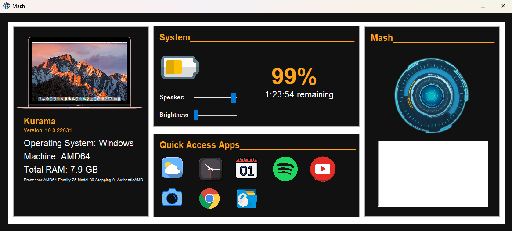

# Mash: Personal Voice Assistant

## Screenshot


## Overview

**Mash** is a personal voice assistant designed for ease of use, enabling users to perform tasks through simple voice commands. The application can shut down the laptop/PC, take notes, set reminders, and more, enhancing productivity and simplifying daily activities.

## Features

- **Voice Command Recognition:** Accurate interpretation of user commands with high success rates, utilizing PyPI's speech recognition module.
- **Task Automation:** Automates routine tasks such as shutting down the system, taking notes, and setting reminders, improving efficiency.
- **User-Friendly Interface:** Developed using Tkinter for an intuitive and accessible graphical interface.
- **Real-Time Processing:** Provides immediate responses to voice commands for a seamless user experience.
- **Modular Design:** Built with a modular architecture in Python for easy feature integration and updates.

## Technologies Used

- **Programming Language:** 
  - Python: For backend processing and voice recognition.
- **Frameworks/Libraries:** 
  - Tkinter: For creating the GUI.
  - PyPI's Speech Recognition Module: For enabling voice command recognition.

## Installation

To set up the project locally, follow these steps:

1. Clone this repository to your local machine:
   ```bash
   git clone https://github.com/Rakshit68/Mash-Personal-Voice-Assistant.git
2. Navigate to the project directory:
   ```bash
   cd Mash-Personal-Voice-Assistant
3. Install required libraries using pip:
   ```bash
   pip install SpeechRecognition
4. Run the GUI.py

## Usage

- Launch the application to start the voice assistant.
- Use voice commands to interact with the assistant (e.g., "shutdown my laptop," "take a note," "set a reminder").
- Enjoy hands-free task management and improved productivity.

## License

This project is licensed under the MIT License.

## Contributing

Contributions are welcome! If you'd like to enhance the project, please fork the repository and submit a pull request. You can also open an issue if you encounter any bugs or have suggestions.
